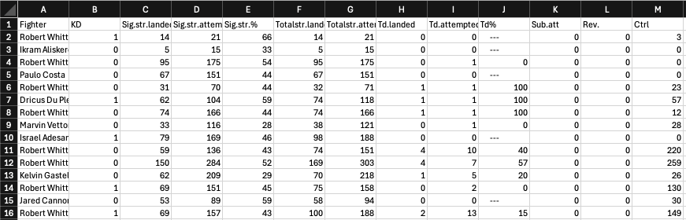

# UFC - a just for fun repo by Firas Abouzahr
In order to combine my passion for data/statistical analysis with my love for the Ultimate Fighting Championship, I decided to create this repository. 

It will be full of codes that scrape data from ufcstats.com and then subsequently analyze these stats in various means. This will be a slow work in progress over time. By the end I hope to incorporate various data science elements into this project including pre-fight predictions through statistical modeling and machine learning, post-fight breakdowns, and just cool data visualizations from individual fights, fighters, or weight classes.


## UFC Data Scraping

Of course to start any analysis we need an efficient way to obtain statistics from [`UFCstats.com`](http://www.ufcstats.com/statistics/events/completed)! I wrote a nice little data scraper for just this,[`UFC-Stats-Scraper.py`](https://github.com/FirasAbouzahr/UFC/blob/main/UFC-Stats-Scraper.py). Here's how to use it:

The following examples are done for Robert "The Reaper" Whittaker.

Lets go ahead and open python and import [`UFC-Stats-Scraper.py`](https://github.com/FirasAbouzahr/UFC/blob/main/UFC-Stats-Scraper.py):

```
Firass-MBP:UFC feef$ python3
Python 3.12.1 (v3.12.1:2305ca5144, Dec  7 2023, 17:23:38) [Clang 13.0.0 (clang-1300.0.29.30)] on darwin
Type "help", "copyright", "credits" or "license" for more information.
>>> from UFC_Stats_Scraper import *
```

The code has three functions in it. ``get_fight_stats()``,``get_fight_URLs()``, and ``get_total_fighter_stats()``. 

``get_fight_stats()`` takes one parameter, a URL string to a specific fight page on [`UFCstats.com`](http://www.ufcstats.com/statistics/events/completed). Each of these fight sites have two main tables on them one called "Totals" and one called "Significant Strikes." ``get_fight_stats()`` will grab the data from these two tables and save them into pandas dataframes. Let's show an example with [`this fight between Robert Whittaker vs Ikram Aliskerov`](http://www.ufcstats.com/fight-details/eba46dbf9cdd83c0).

```
>>> rob_v_Ikram_url = "http://www.ufcstats.com/fight-details/eba46dbf9cdd83c0" 
>>> total_data,significant_striking_data = get_fight_stats(rob_v_Ikram_url) 
>>> print(total_data)
            Fighter   KD  Sig.str.landed  Sig.str.attempted  ...            Td%  Sub.att  Rev.  Ctrl
0  Robert Whittaker  1.0              14                 21  ...        ---          0.0   0.0     3
1   Ikram Aliskerov  0.0               5                 15  ...        ---          0.0   0.0     0

[2 rows x 13 columns]
>>> print(significant_striking_data)
            Fighter  Sig.str.landed  ...  Ground.landed  Ground.attempted
0  Robert Whittaker              14  ...              2                 3
1   Ikram Aliskerov               5  ...              0                 0

[2 rows x 16 columns]
```

The tables also have drop downs that have statistics per round - for now the function does not get this information. Future versions will (: 

However, we want to be a bit more systematic than doing this per fight... So, we use ``get_fight_URLs()`` which takes a specific figher's main page URL on [`UFCstats.com`](http://www.ufcstats.com/statistics/events/completed). The function returns the links to all of the given fighter's individual fight URLs as well their outcomes (e.g., win/loss). This function is then used in ``get_total_fighter_stats()``to aggregate all of the fighter's data into datasheets. This function takes the fighter's main page URL, the file name for the totals data, the file name for the significant strikes data, and a boolean - default is False to not return dataframes and just save them to csv files.

```
>>> rob_whit_url = "http://www.ufcstats.com/fighter-details/e1147d3d2dabe1ce"
>>> get_total_fighter_stats(rob_whit_url,"Robert_Whittaker_Totals.csv","Robert_Whittaker_Significants.csv")
Getting fighter stats...
100%|█████████████████████████████████████████████████████████████████████████| 21/21 [00:10<00:00,  1.91it/s]
Done!
(0, 0)
```
You now have two files with stats from every Robert Whitakker UFC Fight! Below is a snippet image of the contents of "Robert_Whittaker_Totals.csv". The full datasheets (Robert_Whittaker_Totals.csv & Robert_Whittaker_Significants.csv) can be found above.



There is a bit more tweaking to do on this in the future but we're ready to do some fun analysis on the Reaper! 

## Coming Soon - Weight Class Analyses

